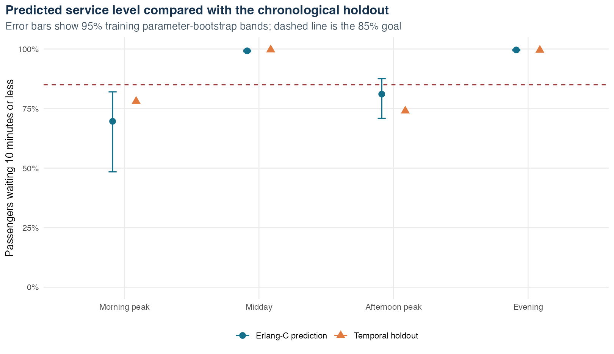

# Airport Checkpoint Queueing: an Erlang-C Case Study

This independent portfolio project models a fictional airport screening checkpoint as an M/M/c queue. It estimates passenger arrival and per-server service rates from separate synthetic timestamps, quantifies uncertainty, validates predictions on later dates, and tests staffing sensitivity under demand and service-speed changes.

**This is a methodological demonstration, not an analysis of a real airport.** No course dataset, real passenger record, or student identifier is included.



## Question and main result

The planning target is for at least 85% of passengers to wait no more than 10 minutes.

- The training model estimates 10-minute service levels of 69.6% in the morning peak and 81.1% in the afternoon peak, placing both below target.
- On the final 28-day chronological holdout, the corresponding observed values are 78.1% and 74.0%. Both remain below target and fall within the training parameter-bootstrap bands. Those bands are not formal predictive intervals.
- Midday and evening exceed 99% in both the model and holdout data.
- The fitted scenario requires one additional server in each peak period at baseline. Under 15% higher demand and 5% slower service, it requires two additional servers in each peak period.

These are controlled synthetic findings. They show how the workflow behaves; they do not justify a real staffing decision.

## Why this version is statistically defensible

Arrival and service rates are estimated independently:

- `lambda = arrivals / scheduled exposure hours`
- `mu = completed services / total observed service hours`

Service durations come from `service_start_time` and `service_end_time`. The observed queue wait is not inverted to manufacture service capacity; it is held back for out-of-time validation.

The analysis also includes:

- a stable, log-scale implementation of the Erlang-C formula;
- an explicit check that traffic intensity is below one;
- 500 day-cluster bootstrap samples for uncertainty;
- a 56-day training period followed by a 28-day temporal holdout;
- demand/service sensitivity analysis;
- baseline and stress staffing scenarios; and
- unit-style checks against M/M/1 identities and monotonicity properties.

## Reproduce the project

Use R 4.5 or a compatible recent version. From the repository root(Terminal), to generate synthetic data, run:

```bash
Rscript scripts/run_all.R
```

Required packages are `dplyr`, `ggplot2`, `knitr`, `lubridate`, `purrr`, `readr`, `rmarkdown`, and `tidyr`. The pipeline stops with a list if any are missing. It then:

1. tests the queueing functions;
2. regenerates every synthetic record from a fixed seed;
3. estimates the model and writes tabular results;
4. recreates all figures; and
5. renders the self-contained HTML report.

The main deliverable is [`report/airport_checkpoint_queueing.html`](report/airport_checkpoint_queueing.html). GitHub does not render an uploaded HTML report directly; enable GitHub Pages for browser viewing or download the file locally.

## Repository structure

```text
airport-checkpoint-queueing/
├── R/queueing_functions.R              # Erlang-C metrics and simulator
├── analysis/airport_checkpoint_queueing.Rmd
├── data/
│   ├── README.md
│   ├── synthetic_checkpoint_events.csv
│   └── synthetic_window_schedule.csv
├── figures/                             # Reproducible portfolio graphics
├── report/airport_checkpoint_queueing.html
├── results/                             # Estimates, validation and scenarios
├── scripts/
│   ├── 01_generate_synthetic_data.R
│   ├── 02_analyze_queue.R
│   └── run_all.R
├── tests/test_queueing_functions.R
└── CHANGES.md
```

## Assumptions

The M/M/c model assumes Poisson arrivals, independent exponential service durations, identical parallel servers, first-come/first-served processing, constant within-period rates, no abandonment, and steady state. The synthetic generator is deliberately aligned with these assumptions. A real checkpoint analysis would require diagnostic checks and probably a time-varying discrete-event simulation.

## Provenance and contribution statement

This repository is an independent portfolio rewrite inspired by a collaborative course exercise. AI assistance helped redesign, document, and test the portfolio version. I reran the pipeline, verified the committed outputs, and reviewed the model assumptions and limitations.

## Data and licence

The included CSV files are generated entirely by `scripts/01_generate_synthetic_data.R` and contain no personally identifiable information. See [`data/README.md`](data/README.md) for the schema and reuse terms.

Project code and documentation are released under the MIT License. The included synthetic data are dedicated to the public domain under CC0 1.0.
